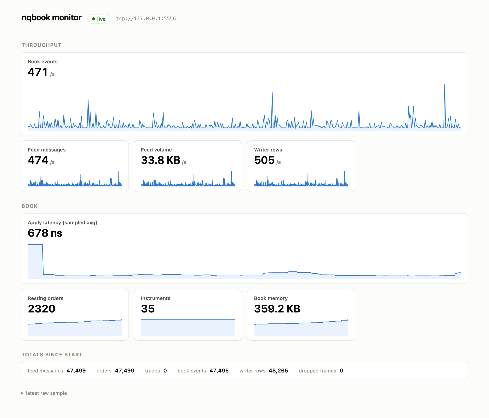

# nqbook-ui

Live dashboard for `nqbook`'s metrics stream. A Next.js server route
subscribes to the service's conflating ZMQ PUB socket, decodes each 120-byte
`nlib::metrics` record, and relays it to the browser over Server-Sent Events;
the page keeps a rolling minute of samples and differences the cumulative
counters into rates client-side. White surface, one blue for every series;
status colors mark only the connection state and the dropped counter.



```bash
npm install
npm run dev                  # http://localhost:3000
NQBOOK_METRICS_ENDPOINT=tcp://127.0.0.1:5556 npm run dev   # the default
```

Run the stack first: `apps/util`'s `md/kraken` publishing on 5555, `nqbook`
in the dev container with `-p 5556:5556` so its metrics socket is reachable
from the host. This app runs on the host with Node, not in the container.

## Shape

```
lib/metrics.ts            nlib::metrics decoder (120 bytes, little-endian)
app/api/metrics/route.ts  SSE bridge: one conflated ZMQ SUB per client
app/page.tsx              the dashboard: rolling window, rates, sparklines
app/globals.css           the white/blue theme tokens
```

- **The browser never speaks ZMQ.** The bridge runs in the Next.js Node
  process (`zeromq` npm package, prebuilt libzmq) and holds one `SUB` per SSE
  client, `conflate` set like the publisher's, so a tab that lags skips to
  the newest sample instead of replaying a backlog.
- **Rates are client-side.** The stream carries cumulative counters;
  the page differences adjacent samples (100 ms apart) for the sparklines and
  smooths the headline numbers over the last second. Apply latency divides
  the timed-apply accumulators over a trailing window, since applies are
  timed 1 in 1024.
- **A counter running backwards means nqbook restarted**; the window resets
  rather than differencing across the restart.
- The connection pill distinguishes a dead bridge (SSE error) from a stalled
  pipeline (bridge up, no sample for 1.5 s).
